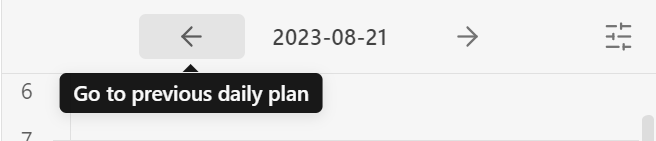
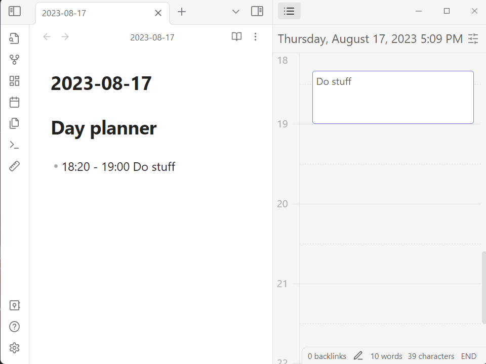

- [Time Block Planner](#time-block-planner)
    - [Note on the new release (0.7.0)](#note-on-the-new-release-070)
    - [Contributing](#contributing)
    - [Basic Usage](#basic-usage)
    - [Features](#features)
        - [Write a plan using a human-readable format or drag-and-drop and see it rendered in a side panel](#write-a-plan-using-a-human-readable-format-or-drag-and-drop-and-see-it-rendered-in-a-side-panel)
        - [Observe your progress in the status bar](#observe-your-progress-in-the-status-bar)
        - [Navigate to plans from past/future notes](#navigate-to-plans-from-pastfuture-notes)
        - [Use the weekly view to plan out the whole week](#use-the-weekly-view-to-plan-out-the-whole-week)
        - [Use drag-and-drop to create and update tasks](#use-drag-and-drop-to-create-and-update-tasks)
    - [Usage](#usage)
    - [Configuration](#configuration)
        - [Status Bar - Circular Progress](#status-bar---circular-progress)
        - [Status Bar - Now and Next](#status-bar---now-and-next)
        - [Task Notification](#task-notification)
        - [Timeline Zoom Level](#timeline-zoom-level)
    - [Commands](#commands)
        - [Show the Day Planner Timeline](#show-the-day-planner-timeline)
        - [Open today's Day Planner](#open-todays-day-planner)
        - [Insert Planner Heading at Cursor](#insert-planner-heading-at-cursor)
    - [Acknowledgements](#acknowledgements)

# Time Block Planner

## Note on the new release (0.7.0)

0.7.0 significantly changes what the plugin looks like and what it does. If you like to have some of the old behaviors back, [consider creating an issue](https://github.com/ivan-lednev/obsidian-day-planner/issues).

If for some reason you still want to use the old version, there are community forks, which you can use via [BRAT](https://github.com/TfTHacker/obsidian42-brat). [Here is one such fork](https://github.com/ebullient/obsidian-day-planner-og).

## Contributing

🪲 [Create issues here](https://github.com/ivan-lednev/obsidian-day-planner/issues)

🪛 Pull-requests are welcome! If you don't know where to start, feel free to create an issue, and I'll provide some
guidance. Also, please check out [CONTRIBUTING](./CONTRIBUTING.md).

You can also support the development of this plugin directly:

## Basic Usage

1. Install the plugin
2. Start writing your daily plan in the daily note
   - Note that the plugin searches for tasks under a preconfigured heading (by default it's `# Day planner`)
3. Open timeline view to monitor your progress with the command: `Show the day planner timeline`

## Features

### Write a plan using a human-readable format or drag-and-drop and see it rendered in a side panel

### Observe your progress in the status bar

### Navigate to plans from past/future notes

### Use the weekly view to plan out the whole week

### Use drag-and-drop to create and update tasks

## Usage

1. **Either the core 'Daily Notes' or the 'Periodic Notes' plugins should be enabled**
1. Install the plugin
1. Configure the heading you want the plugin to look at (see 'Planner heading')
1. Write a plan under the heading in your daily note

## Configuration

### Status Bar - Circular Progress

Show a progress pie instead of a bar.

### Status Bar - Now and Next

You can choose to display the time and start of the text for the current and next task.

### Task Notification

You can choose to have an in-app notification display when a new task starts.

### Timeline Zoom Level

This is the zoom level to display the timeline. The higher the number, the more vertical space each task will take up.

## Commands

### Show the Day Planner Timeline

This reveals the timeline for today.

### Open today's Day Planner

This opens your daily note.

### Insert Planner Heading at Cursor

Insert the planner heading you've configured in the plugin settings.

## Acknowledgements

- Thanks to [James Lynch](https://github.com/lynchjames) for the original plugin
- Thanks to [replete](https://github.com/replete), whose fork I initially forked
