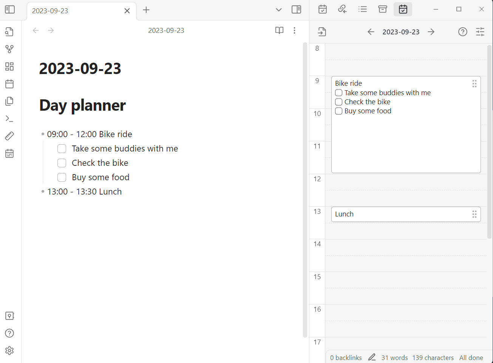

- 🪲 [Create issues](https://github.com/ivan-lednev/obsidian-day-planner/issues)
- 🪛 [Submit pull-requests](./CONTRIBUTING.md)
- ❤️ Support directly:

  

## Table of contents

- [Table of contents](#table-of-contents)
- [Quick demo](#quick-demo)
- [How to use](#how-to-use)
- [Basic features (click to see a demo)](#basic-features-click-to-see-a-demo)
- [Advanced editing (click to see a demo)](#advanced-editing-click-to-see-a-demo)
- [Commands](#commands)
- [Note on the old plugin version](#note-on-the-old-plugin-version)
- [Acknowledgements](#acknowledgements)

## Quick demo

## How to use

1. **Either the core 'Daily Notes' or the 'Periodic Notes' plugins should be enabled**
1. Install the plugin
1. Start writing your daily plan in the daily note
   - Note that the plugin searches for tasks under a preconfigured heading (by default it's `# Day planner`)
1. Open timeline view to monitor your progress with the command: `Show the day planner timeline`

## Basic features (click to see a demo)

Observe your progress in the status bar

Use the week view for multi-day planning

Color tasks based on time

Click on the timeline to create tasks

Drag tasks to re-schedule

## Advanced editing (click to see a demo)

Copy tasks by holding <code>Shift</code> while dragging (<strong>note: right now, only single line tasks are supported</strong>)

Move multiple tasks by holding <code>Control</code> while dragging/resizing

## Commands

- Show the Day Planner Timeline
- Open today's Day Planner
- Show the Week Planner
- Insert Planner Heading at Cursor

## Note on the old plugin version

0.7.0 significantly changes what the plugin looks like and what it does. If you like to have some of the old behaviors back, [consider creating an issue](https://github.com/ivan-lednev/obsidian-day-planner/issues).

If for some reason you still want to use the old version, there are community forks, which you can use via [BRAT](https://github.com/TfTHacker/obsidian42-brat). [Here is one such fork](https://github.com/ebullient/obsidian-day-planner-og).

## Acknowledgements

- Thanks to [James Lynch](https://github.com/lynchjames) for the original plugin
- Thanks to [replete](https://github.com/replete), whose fork I initially forked
