- 🗳️ [Add '👍' reactions under the issues important to you.](https://github.com/ivan-lednev/obsidian-day-planner/issues?q=is%3Aissue+is%3Aopen+sort%3Areactions-%2B1-desc) This helps me prioritize my work
- 🪲 [Report bugs and suggest features](https://github.com/ivan-lednev/obsidian-day-planner/issues)
- ❓ [Ask questions](https://github.com/ivan-lednev/obsidian-day-planner/discussions/new?category=q-a)
- 🛠️ [Submit pull-requests](./CONTRIBUTING.md)
- ❤️ If this project adds value to your life, consider supporting it finantially:
  - <a href="https://www.buymeacoffee.com/machineelf" target="_blank"></a>


Day Planner is a community plugin for [Obsidian](https://obsidian.md/). It adds editable calendar views and basic time-tracking. Day Planner is integrated with

- The core Daily Notes plugin.
- [the Tasks plugin](https://obsidian.md/plugins?id=obsidian-tasks-plugin)
- Online calendars

## Table of contents

- [Table of contents](#table-of-contents)
- [How to use it](#how-to-use-it)
  - [1. Showing events from your daily notes](#1-showing-events-from-your-daily-notes)
  - [2. tasks community plugin integration, showing events from other files in your vault](#2-tasks-community-plugin-integration-showing-events-from-other-files-in-your-vault)
  - [3. Showing internet calendars](#3-showing-internet-calendars)
    - [Where to get a Google Calendar link](#where-to-get-a-google-calendar-link)
    - [Where to get an iCloud link](#where-to-get-an-icloud-link)
    - [Where to get an Outlook link](#where-to-get-an-outlook-link)
      - [Alternative](#alternative)
  - [4. Time tracking](#4-time-tracking)
    - [Recording clocks](#recording-clocks)
    - [Clocks in timelines](#clocks-in-timelines)
    - [Active clocks](#active-clocks)
    - [Limitations](#limitations)
- [Note on the old plugin version](#note-on-the-old-plugin-version)
- [Acknowledgements](#acknowledgements)

## How to use it

> [!Warning]
> Dataview (community plugin, [see in Obsidian](obsidian://show-plugin?id=dataview)) should be installed and enabled for the plugin to work.

To open the timeline in the sidebar:

- Either run the command: `Show Timeline`
- Or click the timeline icon in the left ribbon
  - 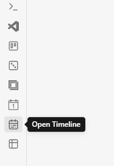

To open multi-day planner:

- Either run the command: `Show multi-day planner`
- Or click on the icon in the left ribbon:
  - 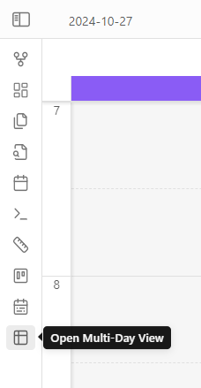

The plugin has 4 distinct 'modes'. That is, it can display records from different sources:

1. Daily notes
2. Obsidian-tasks
3. Online calendars
4. Dataview clock properties

Let's go over each one of them.

### 1. Showing events from your daily notes

> [!Warning]
> Either the core 'Daily Notes' (core plugin) or the 'Periodic Notes' (community plugin, [see in Obsidian](obsidian://show-plugin?id=periodic-notes)) should be enabled. This is what allows day-planner to 'see' and interact with your daily notes.

This works out of the box: you write your tasks in a daily note, and they show up on the timeline:

```md
# Day planner

- [ ] 10:00 - 10:30 Wake up
- [ ] 11:00 - 12:30 Grab a brush and put a little make-up
```

### 2. [tasks community plugin](obsidian://show-plugin?id=obsidian-tasks-plugin) integration, showing events from other files in your vault

This mode allows you to see tasks anywhere in the vault with dates added by the [tasks community plugin](obsidian://show-plugin?id=obsidian-tasks-plugin).

To make this work,

1. Add a tag like `#task` or a folder to the Dataview source field:
   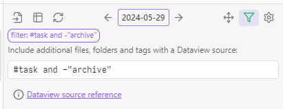
1. Add the tag (`#task` in this example) to the file with some tasks
1. Add the `scheduled` property to a task in one of the formats:
   - Shorthand, added by [tasks community plugin](obsidian://show-plugin?id=obsidian-tasks-plugin): `⏳ 2021-08-29`
     - Note that this plugin has a handy modal for adding these properties
   - Full Dataview-like property: `[scheduled:: 2021-08-29]`
   - Another Dataview format: `(scheduled:: 2021-08-29)`.

Full examples:

```md
- [ ] #task 08:00 - 10:00 This task uses the shorthand format ⏳ 2021-08-29
- [ ] #task 11:00 - 13:00 This task uses the Dataview property format [scheduled:: 2021-08-29]
```

> [!Note]
> For now, the tags work at the level of files. So if `#task` is found anywhere in the file, all the tasks are going to be pulled into the calendar.

### 3. Showing internet calendars

To show events from internet calendars like **Google Calendar, iCloud Calendar and Outlook** you only need to add an ICS link in the plugin settings.

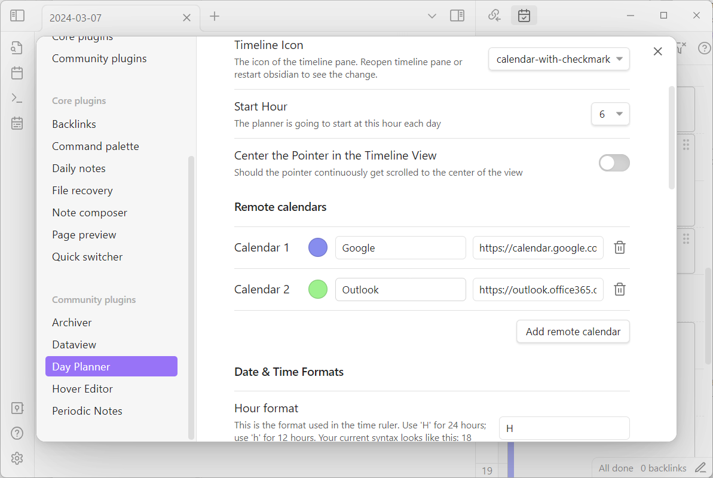

#### Where to get a Google Calendar link

> [!Warning]
> Make sure you copy the right link! It should end with `.ics`, otherwise, you won't see your events!

[Google Calendar instructions](https://support.google.com/calendar/answer/37648?hl=en#zippy=%2Csync-your-google-calendar-view-edit%2Cget-your-calendar-view-only)

#### Where to get an iCloud link

[iCloud Calendar instructions](https://www.souladvisor.com/help-centre/how-to-get-icloud-calendar-address-on-mac-in-ical-format)

#### Where to get an Outlook link

[Outlook Calendar instructions](https://support.microsoft.com/en-us/office/introduction-to-publishing-internet-calendars-a25e68d6-695a-41c6-a701-103d44ba151d?ui=en-us&rs=en-us&ad=us)

Here's the relevant part:

> Under the settings in Outlook **on the web**, go to Calendar > Shared calendars. Choose the calendar you wish to publish and the level of details that you want others to see.

Here's how the settings look on the web version:
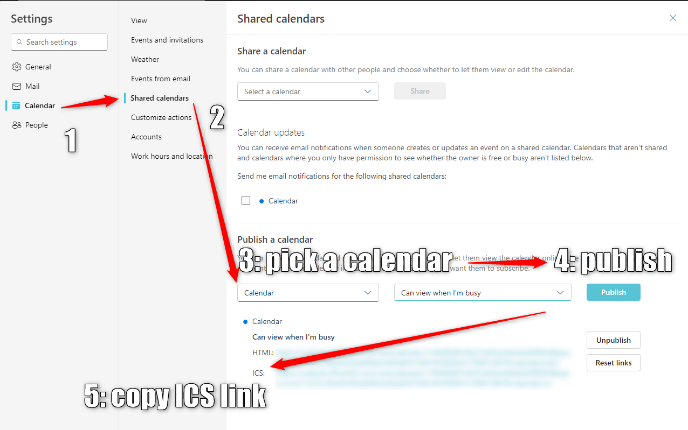

##### Alternative

If your organization doesn't let you share your calendar this way, you might try [a different way described in this issue](https://github.com/ivan-lednev/obsidian-day-planner/issues/395).

### 4. Time tracking

> [!Warning]
> This feature is experimental and can break or change at any time in the near future. You can help to shape this feature by providing your feedback.

You can record time spent on tasks in the form of Dataview properties and then view the records as time blocks, much like planner entries.

#### Recording clocks

Start a clock by right-clicking on a task in the editor:

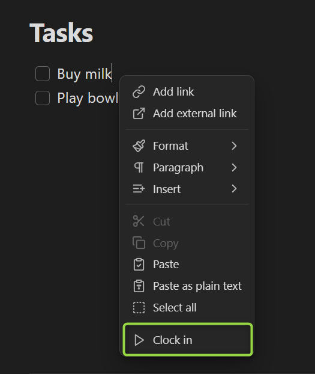

Stop the clock to record the time spent on a task or cancel it to discard the record:

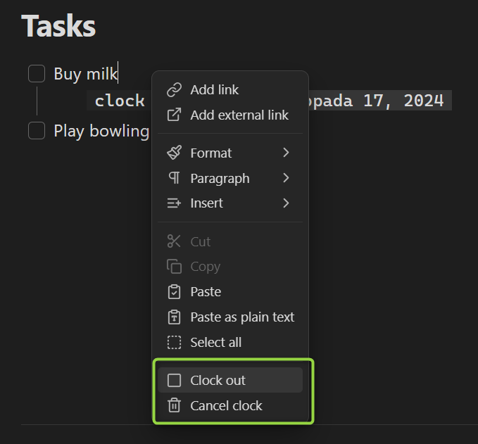

There is a command for each of the menu items, available in the command palette or as a hotkey:

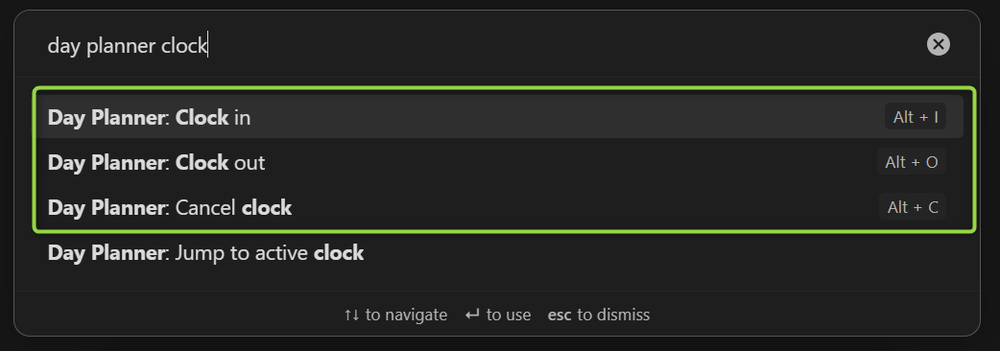

#### Clocks in timelines

You can enable an additional timeline column to see the recorded clocks next to your planner:

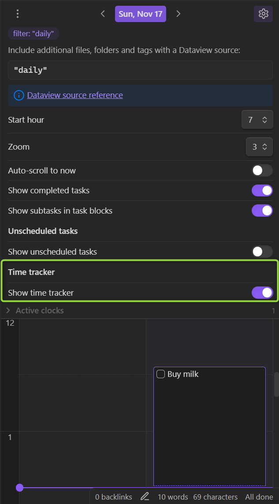

#### Active clocks

You can see the currently active clocks in the timeline sidebar:

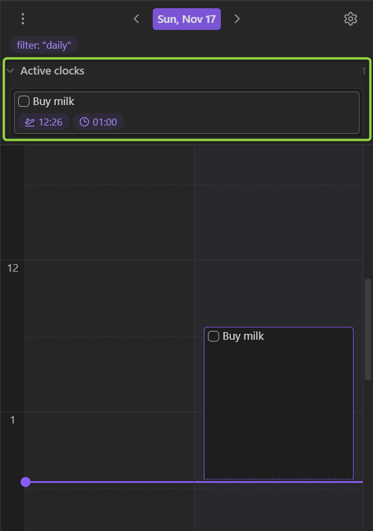

A right click on an active clock will bring the control menu:

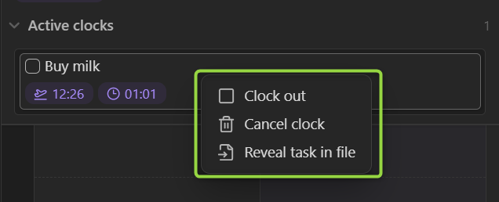

#### Limitations

- For now clock time blocks are read-only. This is going to be addressed in the future.

## Note on the old plugin version

0.7.0 significantly changes what the plugin looks like and what it does. If you like to have some of the old behaviors back, [consider creating an issue](https://github.com/ivan-lednev/obsidian-day-planner/issues).

If for some reason you still want to use the old version, there are community forks, which you can use via [BRAT](https://github.com/TfTHacker/obsidian42-brat). [Here is one such fork](https://github.com/ebullient/obsidian-day-planner-og).

## Acknowledgements

- Thanks to [Michael Brenan](https://github.com/blacksmithgu) for Dataview
- Thanks to [James Lynch](https://github.com/lynchjames) for the original plugin
- Thanks to [Joshua Tazman Reinier](https://github.com/joshuatazrein) for his plugin that served as an inspiration
- Thanks to @liamcain for creating daily note utilities and a helpful calendar plugin
- Thanks to [Emacs Org Mode](https://orgmode.org/) for an idea of text-based time-tracking
- Thanks to [Toggl Track](https://track.toggl.com/timer) for an idea of a great time-tracking UI
