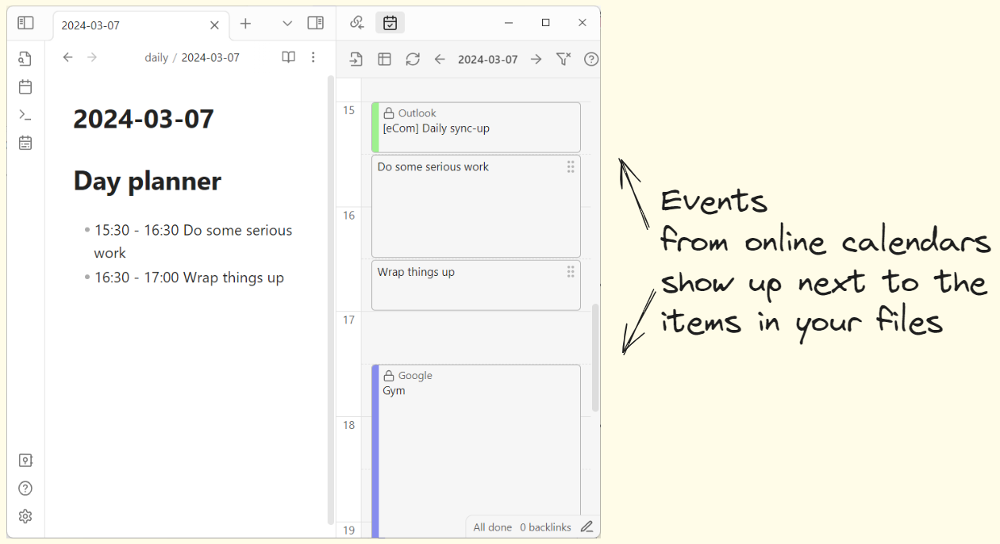
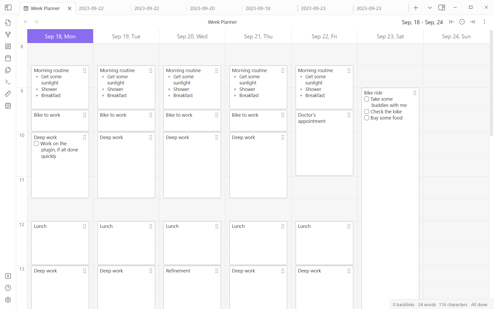
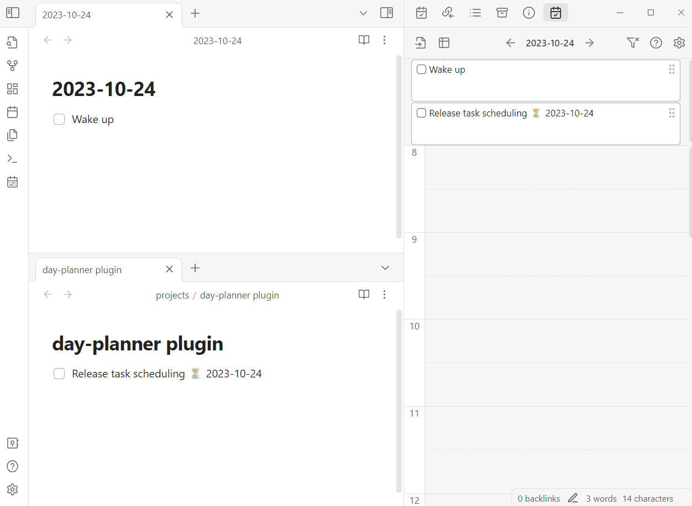
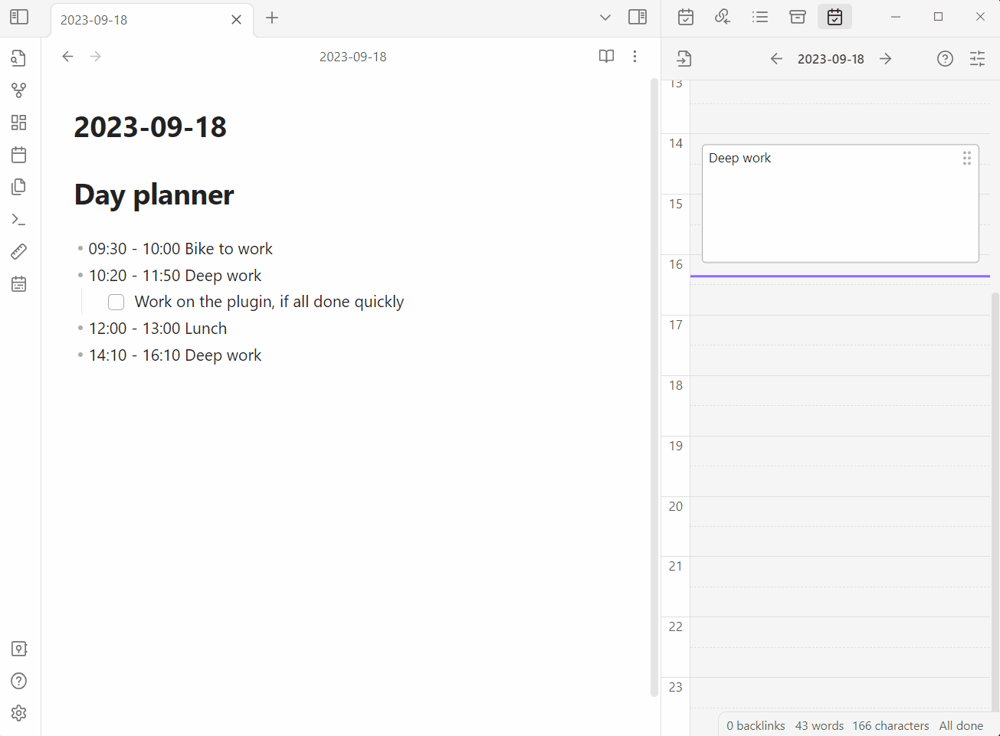

## Table of contents

- [Table of contents](#table-of-contents)
- [What it looks like](#what-it-looks-like)
- [Drag-and-drop demos](#drag-and-drop-demos)
- [How to use it](#how-to-use-it)
  - [1. Showing events from your daily notes](#1-showing-events-from-your-daily-notes)
  - [2. tasks community plugin integration, showing events from other files in your vault](#2-tasks-community-plugin-integration-showing-events-from-other-files-in-your-vault)
  - [3. Showing internet calendars](#3-showing-internet-calendars)
    - [Where to get a Google Calendar link](#where-to-get-a-google-calendar-link)
    - [Where to get an iCloud link](#where-to-get-an-icloud-link)
    - [Where to get an Outlook link](#where-to-get-an-outlook-link)
      - [Alternative](#alternative)
- [What else you can do](#what-else-you-can-do)
- [Commands](#commands)
- [Note on the old plugin version](#note-on-the-old-plugin-version)
- [Acknowledgements](#acknowledgements)

## What it looks like




## Drag-and-drop demos

<details>
<summary>Adding time to tasks</summary>



</details>

<details>
<summary>Basic editing: create, move, resize (click to expand)</summary>



</details>

## How to use it

> [!Warning]
> Dataview (community plugin, [see in Obsidian](obsidian://show-plugin?id=dataview)) should be installed and enabled for the plugin to work.

To see the sidebar with a timeline, run the following command: `Show the day planner timeline`

The plugin has 3 distinct 'modes'. That is, it can display tasks from different sources:

1. Daily notes
1. Obsidian-tasks
1. Online calendars

Let's go over each one of them.

### 1. Showing events from your daily notes

> [!Warning]
> Either the core 'Daily Notes' (core plugin) or the 'Periodic Notes' (community plugin, [see in Obsidian](obsidian://show-plugin?id=periodic-notes)) should be enabled. This is what allows day-planner to 'see' and interact with your daily notes.

This is the most straightforward case that works out of the box: you write your tasks in a daily note and they show up on the timeline:

```md
# Day planner

- [ ] 10:00 - 10:30 Wake up
- [ ] 11:00 - 12:30 Grab a brush and put a little make-up
```

### 2. [tasks community plugin](obsidian://show-plugin?id=obsidian-tasks-plugin) integration, showing events from other files in your vault

This mode allows you to see tasks anywhere in the vault with dates added by the [tasks community plugin](obsidian://show-plugin?id=obsidian-tasks-plugin). With this, day-planner serves as a kind of calendar for the [tasks plugin](obsidian://show-plugin?id=obsidian-tasks-plugin).

To make this work,
1. Add a tag like `#task` or a folder to the Dataview source field. This is how the plugin knows which files it should monitor:
   
1. Add the tag (`#task` in this example) to the file with some tasks
1. Add the `scheduled` property to a task in one of the formats:
   - Shorthand, added by [tasks community plugin](obsidian://show-plugin?id=obsidian-tasks-plugin): `⏳ 2021-08-29`
     - Note that this plugin has a handy modal for adding these properties
   - Full Dataview-like property: `[scheduled:: 2021-08-29]`
   - Another Dataview format: `(scheduled:: 2021-08-29)`.

Full examples:

```md
---
tags: "#task"
---

- [ ] 08:00 - 10:00 This task uses the shorthand format ⏳ 2021-08-29
- [ ] 11:00 - 13:00 This task uses the Dataview property format [scheduled:: 2021-08-29]
```

### 3. Showing internet calendars

To show events from internet calendars like **Google Calendar, iCloud Calendar and Outlook** you only need to add an ICS link in the plugin settings.


#### Where to get a Google Calendar link

[Google Calendar instructions](https://support.google.com/calendar/answer/37648?hl=en#zippy=%2Csync-your-google-calendar-view-edit%2Cget-your-calendar-view-only)

#### Where to get an iCloud link

[iCloud Calendar instructions](https://www.souladvisor.com/help-centre/how-to-get-icloud-calendar-address-on-mac-in-ical-format)

#### Where to get an Outlook link

[Outlook Calendar instructions](https://support.microsoft.com/en-us/office/introduction-to-publishing-internet-calendars-a25e68d6-695a-41c6-a701-103d44ba151d?ui=en-us&rs=en-us&ad=us)

Here's the relevant part:

> Under the settings in Outlook **on the web**, go to Calendar > Shared calendars. Choose the calendar you wish to publish and the level of details that you want others to see.

Here's how the settings look on the web version:


##### Alternative

If your organization doesn't let you share your calendar this way, you might try [a different way described in this issue](https://github.com/ivan-lednev/obsidian-day-planner/issues/395).

## What else you can do

- Observe your progress in the status bar
- Use the week view for multi-day planning
- Color tasks based on time
- Click on the timeline to create tasks
- Drag tasks to re-schedule
- Copy tasks
- Move multiple tasks at once

## Commands

- Show the Day Planner Timeline
- Open today's Day Planner
- Show the Week Planner
- Insert Planner Heading at Cursor

## Note on the old plugin version

0.7.0 significantly changes what the plugin looks like and what it does. If you like to have some of the old behaviors back, [consider creating an issue](https://github.com/ivan-lednev/obsidian-day-planner/issues).

If for some reason you still want to use the old version, there are community forks, which you can use via [BRAT](https://github.com/TfTHacker/obsidian42-brat). [Here is one such fork](https://github.com/ebullient/obsidian-day-planner-og).

## Acknowledgements

- Thanks to [James Lynch](https://github.com/lynchjames) for the original plugin
- Thanks to [replete](https://github.com/replete), whose fork I initially forked
- Thanks to [Michael Brenan](https://github.com/blacksmithgu) for Dataview
- Thanks to [Joshua Tazman Reinier](https://github.com/joshuatazrein) for his plugin, which gave me an idea of how to integrate with Dataview
- Thanks to @liamcain for creating daily note utilities and a helpful calendar plugin
